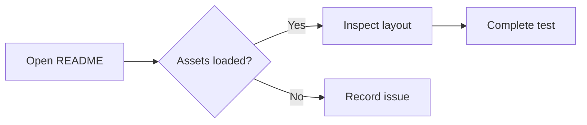

# README Rendering Test · English

This fixture tests **Git repository README previews**, including text, images, animated GIFs, code blocks, and common Markdown extensions.

> Usage: upload the entire `readme-render-test` folder to your repository and preview this file. To test the repository landing page, copy this file to `README.md` in the same directory and keep the relative `assets` location intact.
>
> Standard Markdown, GitHub Flavored Markdown (GFM), and platform extensions have different support levels. Mermaid, mathematics, footnotes, alerts, and HTML are compatibility probes; evaluate them against your product requirements.

[中文版](./README.zh-CN.md) · [Images and animation](#images) · [Code blocks](#code) · [Extensions](#extensions)

## 01. Heading Levels

### Level Three: Feature Overview

#### Level Four: Details

##### Level Five: Additional Information

###### Level Six: Smallest Heading

## 02. Text and Paragraphs

This is a regular English paragraph. Mixed languages: README rendering 测试, version v1.0.0, quantity 12345, price $99.50, and percentage 87.6%.

This is a second paragraph separated by a blank line. Punctuation: commas, periods. Questions? Exclamations! Semicolons; colons: “quotes”, (parentheses), [brackets], em dashes—and ellipses….

**Bold text**, *italic text*, ***bold italic text***, ~~strikethrough~~, `inline code`, <u>HTML underline</u>, and <mark>HTML highlight</mark>.

This line ends with two spaces for a hard line break.  
This sentence should start on the next line.

This line uses an HTML break.<br>This is the next line in the same paragraph.

These two source lines have a single newline,
which the renderer may combine into one paragraph.

Escaped characters: \*not italic\*, \# not a heading, \[not a link\], \`not code\`, and a backslash \\.

Special characters: &amp; &lt; &gt; &quot; © ® ™ ± × ÷ ≤ ≥ → ← ∞.

Unicode: 简体中文 / 繁體中文 / English / 日本語 / 한국어 / café / naïve. Emoji: 😀 ✅ ❌ ⚠️ 🚀 🧪.

Inline code containing backticks: ``const label = `Hello`;``. HTML inside inline code: `<div class="test">Content</div>`.

---

## 03. Lists and Task Lists

- Unordered list: first item A
  - Nested item A.1
    - Third-level item A.1.a
  - Nested item A.2 with **bold text** and `code`
- Unordered list: item B

1. Open the README preview.
2. Inspect the layout.
   1. Check that images are fully visible.
   2. Check that code indentation is preserved.
3. Record the test results.

- [x] Completed: regular text loads
- [x] Completed: Unicode sample prepared
- [ ] Pending: images and GIF playback
- [ ] Pending: narrow viewport and dark theme

1. A list item with another paragraph.

   This additional paragraph should stay aligned with its parent list item.

   ```text
   Code inside a list item
     Preserve two extra spaces
   ```

2. The numbered list continues here.

## 04. Blockquotes and Separators

> First-level quote: the README should display readable content.
>
> A quote containing **bold text**, a [link](https://example.com), and `code`.
>
> > Nested quote: inspect indentation and the quote border.

***

## 05. Links and Anchors

- External link: [Example website](https://example.com "Example link title")
- Automatic link: <https://example.com>
- Email link: <qa@example.com>
- Relative file link: [Chinese README](./README.zh-CN.md)
- In-page link: [Jump to images and animation](#images)
- Reference-style link: [Example documentation][example-reference]
- Path with spaces and Chinese characters: [Open image](./assets/%E4%B8%AD%E6%96%87%20%E5%9B%BE%E7%89%87.png)

[example-reference]: https://example.com "Reference link title"

<a id="images"></a>

## 06. Images and Animation

All images use repository-relative paths and require no external image host. Check for distortion, unexpected cropping, overflow, or missing content.

### Static PNG Image


### Static JPEG Image


### SVG Vector Image


### Animated GIF

The dot should travel from left to right while the progress bar and frame number change continuously. Playback should loop instead of remaining on the first frame.


### Filename with Chinese Characters and a Space


### Linked Image

[](./README.zh-CN.md)

### HTML Image Sizing and Alignment (Compatibility Probe)

<p align="center">
  
</p>

<a id="code"></a>

## 07. Code Blocks

### JavaScript: Highlighting, Indentation, Unicode, and Template Strings

```javascript
const user = { name: "Test User 测试用户", enabled: true };
function greet(person) {
  // Check Unicode comments and special characters < > &
  return `Hello, ${person.name}!`;
}
console.log(greet(user));
```

### Python

```python
def summarize(values: list[int]) -> dict:
    """Return statistics; preserve four-space indentation."""
    return {"count": len(values), "total": sum(values)}

print(summarize([1, 2, 3]))
```

### JSON

```json
{
  "name": "README Rendering Test",
  "enabled": true,
  "count": 3,
  "tags": ["中文", "English", "images"],
  "optional": null
}
```

### HTML and CSS: Render as Source Code

```html
<section class="card">
  <h1>Test Heading &amp; Demo</h1>
  <p>This HTML should appear as source code.</p>
</section>
```

```css
.card {
  color: #2563eb;
  padding: 16px;
  border: 1px solid #cbd5e1;
}
```

### Shell, SQL, YAML, and Diff

```bash
printf '%s\n' "Hello, README"
```

```sql
SELECT id, name FROM users
WHERE enabled = TRUE
ORDER BY id DESC LIMIT 10;
```

```yaml
project:
  name: "Rendering Test"
  languages:
    - zh-CN
    - en
```

```diff
- title: Old title
+ title: New title
  enabled: true
```

### Unlabeled, Indented, and Nested Code Blocks

```
First line
    Second line: preserve four spaces
<raw text> & **this should not be bold**
```

    This is a four-space indented code block.
    **This should not be bold either.**

````markdown
The following example shows a fenced block in Markdown source:
```javascript
console.log("Nested fence test");
```
````

### Horizontal Scrolling for Long Lines

```text
LONG_LINE_START_0123456789_ABCDEFGHIJKLMNOPQRSTUVWXYZ_0123456789_ABCDEFGHIJKLMNOPQRSTUVWXYZ_0123456789_ABCDEFGHIJKLMNOPQRSTUVWXYZ_0123456789_ABCDEFGHIJKLMNOPQRSTUVWXYZ_0123456789_ABCDEFGHIJKLMNOPQRSTUVWXYZ_LONG_LINE_END
```

## 08. Tables

| ID | Content (Left Aligned) | Status (Centered) | Value (Right Aligned) |
| --- | :--- | :---: | ---: |
| 001 | **Bold** and *italic* | ✅ | 123.45 |
| 002 | `inline code` | Pending | 8 |
| 003 | [External link](https://example.com) | 🔗 | 1000 |
| 004 | Escaped pipe A \| B | OK | -1 |
| 005 | First line<br>Second line | Break | 0 |
| 006 |  | Empty cell |  |

| Image in a Table | Code in a Table | Longer Description |
| :---: | --- | --- |
|  | `status === "ok"` | Check cell layout when an image, inline code, and a longer English description share the same row. |

<a id="extensions"></a>

## 09. Extensions (Validate Against Product Requirements)

### Collapsible Content

<details>
<summary>Expand: additional content and code</summary>

This is **formatted text** inside the collapsible section.

- First item inside the section
- Second item inside the section

```json
{"expanded": true, "message": "Content is visible"}
```

</details>

### Keyboard Keys, Subscripts, and Superscripts

Shortcut: <kbd>Ctrl</kbd> + <kbd>C</kbd>. Formula: H<sub>2</sub>O. Square: x<sup>2</sup>.

### GitHub-style Alerts

> [!NOTE]
> A regular note: inspect its icon, heading, and body style.

> [!TIP]
> Inspect contrast in both light and dark themes.

> [!IMPORTANT]
> Upload the local assets together with the README files.

> [!WARNING]
> These extension probes depend on the product's supported features.

> [!CAUTION]
> This content is only an alert styling sample.

### Mathematics

Inline formula: $E = mc^2$.

$$
\sum_{i=1}^{n} i = \frac{n(n+1)}{2}
$$

### Mermaid Flowchart



### Footnotes

This sentence references the first footnote[^note], followed by a multilingual footnote[^chinese].

[^note]: English footnote text. Check navigation to the note and back.
[^chinese]: 中文脚注 with **bold text** and `inline code`.

## 10. Boundary Content and Inspection Checklist

This longer paragraph checks wrapping and container boundaries on narrow screens. When a README contains ordinary sentences, 中文说明, punctuation, and numbers such as 0123456789, its content should remain readable without overlapping text, unexpected clipping, missing paragraphs, or content covering nearby elements. The complete text should remain accessible when zooming, selecting, and copying content.

Long unbroken string: ABCDEFGHIJKLMNOPQRSTUVWXYZ0123456789ABCDEFGHIJKLMNOPQRSTUVWXYZ0123456789ABCDEFGHIJKLMNOPQRSTUVWXYZ0123456789ABCDEFGHIJKLMNOPQRSTUVWXYZ0123456789.

Empty-value samples: null / undefined / empty string `""` / number `0` / boolean `false`.

- [ ] Headings, paragraphs, blank lines, and line breaks render as expected.
- [ ] Chinese, English, symbols, and emoji display without encoding errors.
- [ ] PNG, JPEG, and SVG images load; the GIF loops continuously.
- [ ] Relative paths, Unicode filenames, anchors, and cross-file links work.
- [ ] Code indentation, special characters, fences, and long lines remain intact.
- [ ] Lists, quotes, and tables remain readable on narrow screens.
- [ ] Extensions are checked against the product's supported feature list.
- [ ] Readability is checked in light mode, dark mode, and at 200% zoom.

**End of the English README rendering test.**
