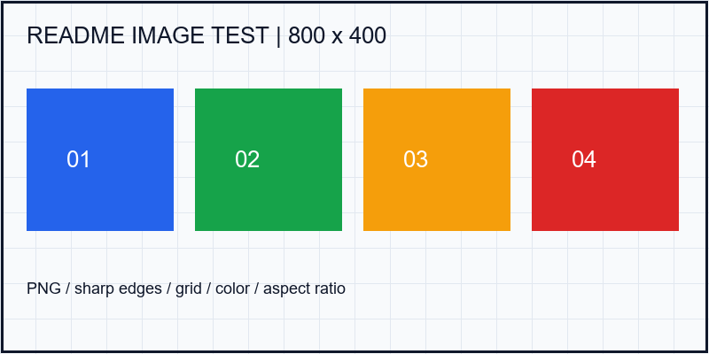
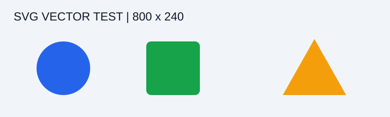
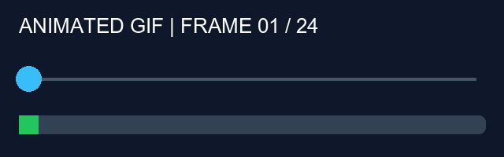
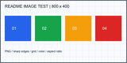
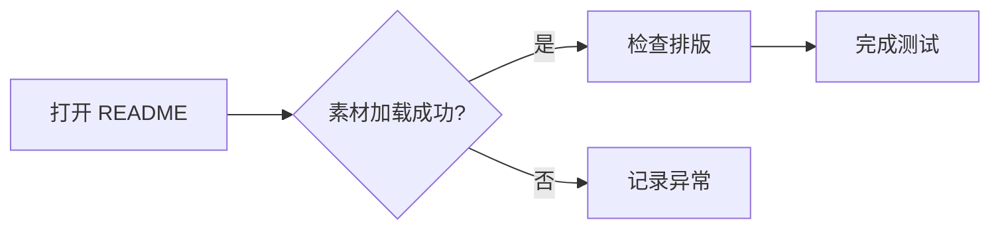

# README 渲染测试 · 中文版

这是一份用于 **Git 仓库 README 预览** 的测试数据，覆盖中文、英文、图片、动图、代码块和常见扩展格式。

> 测试方式：将整个 `readme-render-test` 文件夹上传至仓库，打开本文件预览。若需测试仓库首页，可将本文件复制为同目录下的 `README.md`，保持 `assets` 目录的相对位置不变。
>
> 普通 Markdown、GitHub 风格 Markdown（GFM）与各平台扩展支持范围不同。Mermaid、数学公式、脚注、提示块和 HTML 是兼容性探测项，应结合产品需求判断，不能仅因未渲染就认定为缺陷。

[English version](./README.en.md) · [图片与动图](#images) · [代码块](#code) · [扩展格式](#extensions)

## 01. 标题层级

### 三级标题：功能介绍

#### 四级标题：详细说明

##### 五级标题：补充说明

###### 六级标题：最小标题

## 02. 文本与段落

这是一段普通中文海洛因，病毒，可卡因。中英混排：README rendering 测试，版本 v1.0.0，数量 12345，金额 ¥99.50，百分比 87.6%。

这是通过空行分隔的第二段。标点覆盖：，。！？；：“中文引号”、《书名》、（括号）、【标签】、破折号——以及省略号……。

**粗体文字**、*斜体文字*、***粗斜体***、~~删除线~~、`行内代码`、<u>HTML 下划线</u>、<mark>HTML 高亮</mark>。

这一行末尾有两个空格，用来测试硬换行。  
这一行应紧接着显示在下一行。

这一行使用 HTML 换行。<br>这是同一段里的下一行。

这两行之间只有源码中的换行，
渲染器可能把它们合并为同一段落。

转义字符：\*不是斜体\*、\# 不是标题、\[不是链接\]、\`不是代码\`、反斜杠 \\。

特殊字符：&amp; &lt; &gt; &quot; © ® ™ ± × ÷ ≤ ≥ → ← ∞。

Unicode：简体中文 / 繁體中文 / English / 日本語 / 한국어 / café / naïve。Emoji：😀 ✅ ❌ ⚠️ 🚀 🧪。

行内代码包含反引号：``const label = `你好`;``。行内代码中的 HTML：`<div class="test">内容</div>`。

---

## 03. 列表与任务清单

- 无序列表：一级项目 A
  - 二级项目 A.1
    - 三级项目 A.1.a
  - 二级项目 A.2，包含 **粗体** 和 `code`
- 无序列表：一级项目 B

1. 第一步：打开 README。
2. 第二步：检查排版。
   1. 检查图片是否完整显示。
   2. 检查代码是否保留缩进。
3. 第三步：记录测试结果。

- [x] 已完成：普通文本加载
- [x] 已完成：中文编码检查
- [ ] 待执行：图片和 GIF 检查
- [ ] 待执行：窄屏、深色主题检查

1. 列表项包含独立段落。

   这是列表项内的补充段落，应与该列表项对齐。

   ```text
   列表项内代码块
     保留两个空格的缩进
   ```

2. 列表继续编号。

## 04. 引用与分隔线

> 一级引用：README 应正确显示中文内容。
>
> 引用中的 **粗体**、[链接](https://example.com) 和 `代码`。
>
> > 二级引用：检查嵌套缩进与左侧边框。

***

## 05. 链接与锚点

- 外部链接：[示例站点](https://example.com "示例链接提示文字")
- 自动链接：<https://example.com>
- 邮件链接：<qa@example.com>
- 相对文件链接：[英文 README](./README.en.md)
- 页内链接：[跳转到图片与动图](#images)
- 引用式链接：[示例说明][example-reference]
- 带空格及中文路径：[查看中文文件名图片](./assets/%E4%B8%AD%E6%96%87%20%E5%9B%BE%E7%89%87.png)

[example-reference]: https://example.com "引用式链接标题"

<a id="images"></a>

## 06. 图片与动图

以下图片使用仓库内相对路径，不依赖外部图床。检查图片是否失真、被裁切、溢出或无法加载。

### PNG 静态图片



### JPEG 静态图片


### SVG 矢量图片



### GIF 动图

圆点应从左向右移动，进度条和帧编号应持续变化并循环播放。不能只显示静止首帧。



### 中文与空格文件名


### 带链接的图片

[](./README.en.md)

### HTML 图片尺寸与居中（兼容性探测）

<p align="center">
  
</p>

<a id="code"></a>

## 07. 代码块

### JavaScript：高亮、缩进、中文、模板字符串

```javascript
const user = { name: "测试用户", enabled: true };
function greet(person) {
  // 检查中文注释和特殊字符 < > &
  return `你好，${person.name}！`;
}
console.log(greet(user));
```

### Python

```python
def summarize(values: list[int]) -> dict:
    """返回统计结果，检查四空格缩进。"""
    return {"数量": len(values), "合计": sum(values)}

print(summarize([1, 2, 3]))
```

### JSON

```json
{
  "name": "README 渲染测试",
  "enabled": true,
  "count": 3,
  "tags": ["中文", "English", "图片"],
  "optional": null
}
```

### HTML 与 CSS：必须显示为代码

```html
<section class="card">
  <h1>测试标题 &amp; Demo</h1>
  <p>这段 HTML 应显示源码。</p>
</section>
```

```css
.card {
  color: #2563eb;
  padding: 16px;
  border: 1px solid #cbd5e1;
}
```

### Shell、SQL、YAML 与 Diff

```bash
printf '%s\n' "你好，README"
```

```sql
SELECT id, name FROM users
WHERE enabled = TRUE
ORDER BY id DESC LIMIT 10;
```

```yaml
project:
  name: "渲染测试"
  languages:
    - zh-CN
    - en
```

```diff
- title: 旧标题
+ title: 新标题
  enabled: true
```

### 无语言标记、缩进代码与嵌套围栏

```
第一行
    第二行：保留四个空格
<原始文本> & **这里不应加粗**
```

    这是四空格缩进代码块。
    **这里也不应加粗。**

````markdown
下面展示 Markdown 源码中的代码块：
```javascript
console.log("嵌套围栏测试");
```
````

### 长行横向滚动

```text
LONG_LINE_START_0123456789_ABCDEFGHIJKLMNOPQRSTUVWXYZ_0123456789_ABCDEFGHIJKLMNOPQRSTUVWXYZ_0123456789_ABCDEFGHIJKLMNOPQRSTUVWXYZ_0123456789_ABCDEFGHIJKLMNOPQRSTUVWXYZ_0123456789_ABCDEFGHIJKLMNOPQRSTUVWXYZ_LONG_LINE_END
```

## 08. 表格

| 编号 | 测试内容（左对齐） | 状态（居中） | 数值（右对齐） |
| --- | :--- | :---: | ---: |
| 001 | **粗体** 与 *斜体* | ✅ | 123.45 |
| 002 | `inline code` | 待测 | 8 |
| 003 | [外部链接](https://example.com) | 🔗 | 1000 |
| 004 | 转义竖线 A \| B | 正常 | -1 |
| 005 | 第一行<br>第二行 | 换行 | 0 |
| 006 |  | 空单元格 |  |

| 表格内图片 | 表格内代码 | 较长描述 |
| :---: | --- | --- |
|  | `status === "ok"` | 用于检查图片、代码和较长中文描述同时存在时的单元格排版。 |

<a id="extensions"></a>

## 09. 扩展格式（按产品支持范围验证）

### 折叠内容

<details>
<summary>点击展开：补充内容与代码</summary>

这是折叠区域内的 **中文说明**。

- 折叠内列表项目一
- 折叠内列表项目二

```json
{"expanded": true, "message": "展开成功"}
```

</details>

### 键盘、上下标

快捷键：<kbd>Ctrl</kbd> + <kbd>C</kbd>。化学式：H<sub>2</sub>O。平方：x<sup>2</sup>。

### GitHub 风格提示块

> [!NOTE]
> 这是普通说明，检查图标、标题和内容样式。

> [!TIP]
> 可分别使用浅色和深色主题检查对比度。

> [!IMPORTANT]
> 本地素材必须与 README 一起上传。

> [!WARNING]
> 本节属于扩展能力测试，支持范围取决于产品约定。

> [!CAUTION]
> 此内容仅为提示块样式样本。

### 数学公式

行内公式：$E = mc^2$。

$$
\sum_{i=1}^{n} i = \frac{n(n+1)}{2}
$$

### Mermaid 流程图



### 脚注

这里引用第一条脚注[^note]，再引用一个包含英文的脚注[^english]。

[^note]: 中文脚注正文，检查跳转与返回行为。
[^english]: English footnote with **bold text** and `inline code`.

## 10. 边界内容与检查要点

以下是长中文段落，用于验证窄屏换行和容器边界：当 README 中存在连续的中文说明、EnglishWords、中英文标点以及数字 0123456789 时，正文应保持清晰可读，不应出现文字重叠、异常截断、段落消失或覆盖其他内容；放大页面后也应能够继续阅读完整内容，并能正常选择和复制文字。

长连续字符串：ABCDEFGHIJKLMNOPQRSTUVWXYZ0123456789ABCDEFGHIJKLMNOPQRSTUVWXYZ0123456789ABCDEFGHIJKLMNOPQRSTUVWXYZ0123456789ABCDEFGHIJKLMNOPQRSTUVWXYZ0123456789。

空值样例：null / undefined / 空字符串 `""` / 数字 `0` / 布尔值 `false`。

- [ ] 标题、段落、空行、换行符合预期。
- [ ] 中文、英文、符号和 Emoji 无乱码。
- [ ] PNG、JPEG、SVG 正常显示；GIF 持续循环。
- [ ] 相对路径、中文文件名、页内链接和跨文件链接可用。
- [ ] 代码缩进、特殊字符、围栏和长行完整保留。
- [ ] 列表、引用、表格在窄屏下仍可阅读。
- [ ] 按产品约定验证扩展格式，并记录不支持项。
- [ ] 在浅色、深色主题及 200% 缩放下检查可读性。

**中文 README 测试结束。**
